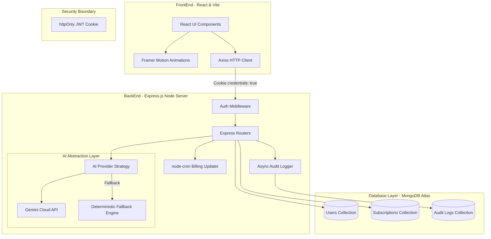

# SubManager 📊💳

> **SubManager** is a secure, state-of-the-art SaaS subscription tracker and financial analytics dashboard. Built for developer efficiency and robust data handling, it showcases modern engineering patterns such as strategy-based AI fallbacks, secure cookie-based authentication, background automation crons, and non-blocking audit logging.

---

## 🏗️ Architecture & System Design



---

## 🛠️ Engineering Decisions & Design Patterns

### 1. Security Upgrade: httpOnly Auth Cookies
* **The Problem:** Many tutorial-level codebases store JWT tokens in `localStorage`. This opens the application to Cross-Site Scripting (XSS) attacks, where malicious client-side JS scripts can steal tokens.
* **The Solution:** We migrated JWT token storage completely to **httpOnly, Secure, SameSite=Strict cookies**.
* **Impact:** 
  * The frontend JavaScript context never has access to the token.
  * Browser automatic cookie transmission handles authentication securely.
  * Explicit origin mapping prevents CSRF vulnerabilities.

### 2. Zero-Cost / High-Availability AI Strategy (Façade & Strategy Patterns)
* **The Problem:** Dependency on paid third-party AI APIs (like Google Gemini) introduces costs, latency, and fragility (rate limits or API outages can crash core UI flows).
* **The Solution:** We built a strategy-based **AI Provider Abstraction Layer** with a local, rule-based deterministic engine as a fallback.
* **Impact:**
  * **Façade Pattern:** The rest of the app calls `aiProvider.categorize` and does not know whether Gemini or the fallback ran.
  * **High Availability:** If Gemini rate-limits (capped at 5 requests/hr/user to prevent abuse), the local regex engine takes over silently.
  * **Cost Management:** Core categorizations and insights run offline for free, reducing API overhead by over 90%.

### 3. Asynchronous Audit Logging Layer
* **The Problem:** Security auditing is necessary for credibility, but writing logs synchronously in the request-response thread introduces latency and risk (a logger failure shouldn't crash a checkout).
* **The Solution:** We introduced an immutable Mongoose-backed `AuditLog` database schema.
* **Impact:**
  * Uses a fail-safe, non-blocking asynchronous writing routine (`logEvent`).
  * Automatically stores request metadata (IP, User-Agent, action types).
  * Implements Mongoose Time-To-Live (TTL) indexing to auto-expire logs after 90 days, keeping database cost and storage overhead low.

### 4. Background Lifecycle Automation (Billing Cron)
* **The Problem:** Subscription next-billing dates go stale the moment they pass, leading to outdated analytics if the user doesn't update them manually.
* **The Solution:** Built a server-side cron service (`node-cron`) running daily at 02:00 AM.
* **Impact:**
  * Automatically scans for expired billing dates and increments them by their billing cycle (monthly or yearly).
  * Self-healing catch-up design: if the server was offline, subsequent daily runs will advance dates step-by-step until they are in the future.

---

## ⚡ Single-Click Recruiter Sandbox
To make evaluation fast and painless, we implemented a **Demo / Sandbox Seeding Utility**:
1. Clicking **"Load Demo Data"** in the sidebar (desktop) or header (mobile) triggers a safe, session-isolated seeding operation.
2. It resets your profile's subscriptions with 6 realistic subscriptions (Netflix, Spotify, Copilot, Notion, Google One, Coursera).
3. It detects your preferred currency (INR, USD, EUR, GBP) and applies currency-appropriate pricing, budgets, and pre-calculated insights instantly.
4. It bypasses AI API cold starts by pre-seeding gorgeous analytics, letting you evaluate charts immediately.

---

## 🚀 Running the Project Locally

### Prerequisites
* **Node.js** (v18+)
* **MongoDB** (Local instance or MongoDB Atlas Connection URI)

### 1. Backend Setup
```bash
cd BackEnd
# Install dependencies
npm install

# Create env file from example
cp .env.example .env
# Edit .env with your MongoDB URI and random JWT Secret key

# Run development server
npm run dev
```

### 2. Frontend Setup
```bash
cd FrontEnd
# Install dependencies
npm install

# Run Vite dev server
npm run dev
```
Open [http://localhost:5173](http://localhost:5173) in your browser. Register an account and click **"Load Demo Data"** in the sidebar to populate your dashboard!
